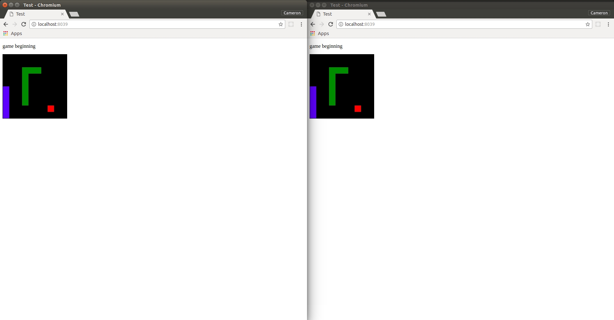

# Your favourite arcade game. Now multiplayer.

Welcome to websnake!

Websnake is a web development project of mine written in the Go programming language. Although still in development, the ultimate goal is to allow players to play a multiplayer implementation of snake against each other over the internet. Most of the game architecture has been built, but the details are still a work in progress- If you have any suggestions for game size, number of snakes, or victory conditions, let me know!

Websnake makes use of Goroutines to handle concurrency on the web server. Clients connect to the server via Desertbit's Glue Socket Library, enabling websocket communication during the game. The front-end UI is very bare at the moment, but I'm planning to write it properly with React.js when I get a chance.

To give websnake a try, clone the GitHub repository, run the `./websnake` executable and navigate to `localhost:8039`. Enjoy!