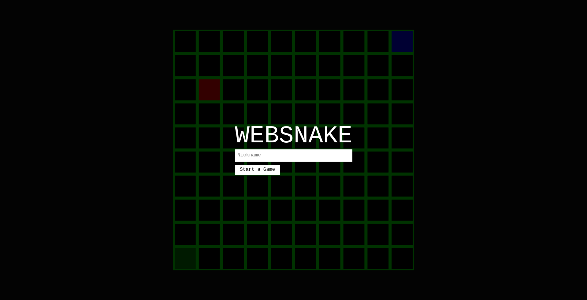

# Websnake

Websnake is a web development project of mine written in the Go programming language. Although still in development, the ultimate goal is to allow players to play a multiplayer implementation of snake against each other over the internet.

Websnake makes use of Goroutines to handle concurrency on the web server. Clients connect to the server via Desertbit's Glue Socket Library, enabling websocket communication during the game. The front-end UI is written in React.js.

To give websnake a try:
1. Clone the repository
3. Run `npm install` and `webpack` in the "public" directory
4. Run `go build` and `./websnake` in the root directory
5. Navigate to `localhost:8069` and enjoy